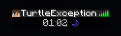
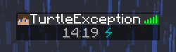

[version-shield]: https://img.shields.io/github/v/release/TurtleException/TabTime?include_prereleases
[license-shield]: https://img.shields.io/github/license/TurtleException/TabTime
[build-shield]: https://img.shields.io/github/actions/workflow/status/TurtleException/TabTime/build.yaml

<!--suppress HtmlRequiredAltAttribute, CheckImageSize -->

[![version-shield]](https://github.com/TurtleException/TabTime/releases)
[![license-shield]](LICENSE)
[![build-shield]](https://github.com/TurtleException/TabTime/actions/workflows/build.yaml)

# TabTime
This simple spigot plugin displays the current in-game time (interpreted as 24-hour time) and weather in the player-list
(`TAB` key by default) for each current world of any player.

Please note that this plugin will not be compatible with any other plugin that uses the bottom text of the player list.

