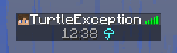

[version-shield]: https://img.shields.io/github/v/release/TurtleException/TabTime?include_prereleases
[license-shield]: https://img.shields.io/github/license/TurtleException/TabTime
[build-shield]: https://img.shields.io/github/actions/workflow/status/TurtleException/TabTime/build.yaml

[![version-shield]](https://github.com/TurtleException/FancyFormat/releases)
[![license-shield]](LICENSE)
[![build-shield]](https://github.com/TurtleException/FancyFormat/actions/workflows/build.yaml)

# TabTime
This simple spigot plugin displays the current in-game time (interpreted as 24-hour time) and weather in the player-list
(`TAB` key by default) for each current world of any player.

